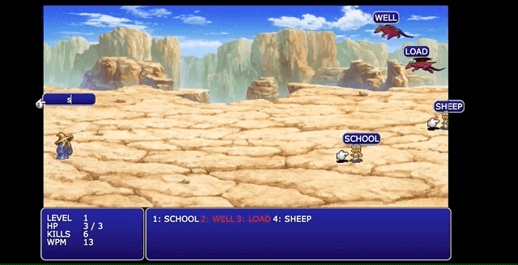

## TYPING FANTASY
---


Typing Fantasy is a speed typing game inspired by the classic game, The Typing of the Dead developed by Sega. 

As a swarm of enemy and dragon approaches the black mage, the player must input the 

Technologies used: Javascript, CSS3, HTML5

[Live Site](https://trombed.github.io/typing_game/)

---


## Canvas and DOM Manipulation
---

Instead of drawing everything onto the canvas, I took a different approach of only using canvas for drawing sprites and sprites animations only. 

Background images are rendered as background-images of a div on a layer beneath the canvas. This approach lets me use CSS animation or translation to perform different effects on background changes.

Each word on top of enemies is a div container that is rendered on top of the canvas. I find this approach makes styling easier and text easier to read. 

## Canvas Animations
---

Canvas element only handles the rendering of sprites animnations, 
For each frame that is rendered it will call the following:

A check to see if any word is completed which we will then call a function to have the enemy deleted off the canvas which will call an explosion animation in its place. 

Another check in the rendering is to see if the enemy sprite has crossed over the boundary, which will then decrease the player's life.

A call to the player this.drawPlayer() which will check what kind of animation or pose to be rendered. 

And last but not least a call to see if the game needs to be ended because the player's health has been depleted. 

```
    animate() {
        this.render = requestAnimationFrame(this.animate.bind(this));
        this.ctx.clearRect(0,0, this.canvas.width, this.canvas.height);
        this.drawEnemies();
        this.drawExplosions();
        this.checkOOB();
        this.checkInput();
        this.select();
        if (this.health <= 0) {
            this.player.alive = false; 
            this.drawPlayer()
            this.gameOvered();
            cancelAnimationFrame(this.render);
        }
        this.drawPlayer();
    }
```


CSS Animation Timed Event:
---


One aspect I use css for animation was for a timer function instead of using a setInterval, I did this through DOM manipulation and events listeners.

When an animation is needed, the css class is added to the element. Afterward by adding a event listener to look for when the "animation end", it removes the animation class and event listener.


```
 showLevelUp() {
        let animate = document.getElementById("Level-Up")
        animate.classList.add("Level-Up-Animation")

        animate.addEventListener("animationend", () => {
            animate.classList.remove("Level-Up-Animation")
        })

        animate.removeEventListener("animationend", () => {
            animate.classList.remove("Level-Up-Animation")
        })
    }
```

```
.Level-Up-Animation {
    animation: level 3s;
}

keyframes level {
    0% { opacity: 0%;}
    100% { opacity: 100%;}
}
```


