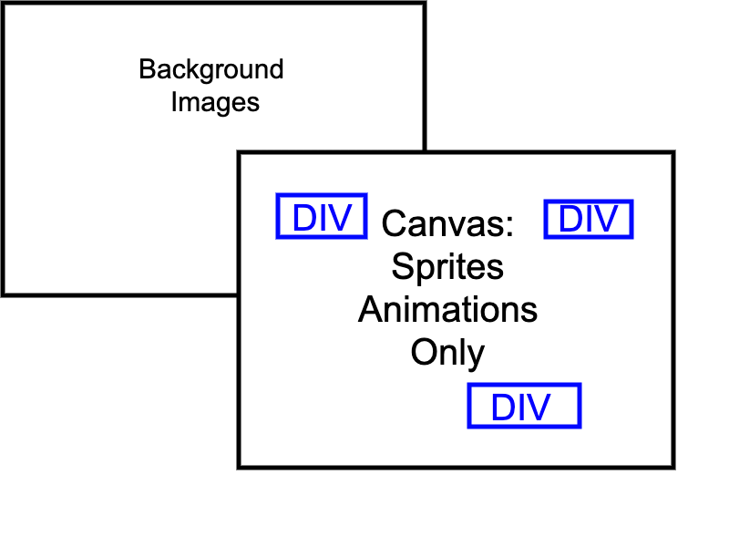

## TYPING FANTASY
---
Typing Fantasy is a speed typing game inspired by the classic game, The Typing of the Dead developed by Sega. 

Technologies used: Javascript, CSS3, HTML5

---


## Canvas and DOM Manipulation
---

Instead of drawing everything onto the canvas, I took a different approach of only using canvas for handling sprites and animations only. 

Background images are rendered as background-images of a div on a layer beneath the canvas. This approach lets me use CSS animation or translation to perform different effects on background changes.

Each word on top of enemies are a div container that is rendered on top of the canvas. I find this approach makes styling easier and text cleaner. 


CSS Animation Timed Event:
---


One aspect I used on css animation was instead of using a setInterval timer, I did this through DOM manipulation and events listeners.

When an animation is needed, the css class is added to the element. Afterward by adding a event listener to look for when the "animation end", it removes the class and event listener again.


```
 showLevelUp() {
        let animate = document.getElementById("Level-Up")
        animate.classList.add("Level-Up-Animation")

        animate.addEventListener("animationend", () => {
            animate.classList.remove("Level-Up-Animation")
        })

        animate.removeEventListener("animationend", () => {
            animate.classList.remove("Level-Up-Animation")
        })
    }
```

```
.Level-Up-Animation {
    animation: level 3s;
}

keyframes level {
    0% {
        opacity: 0%;
    }
    100% {
        opacity: 100%;
    }
}
```